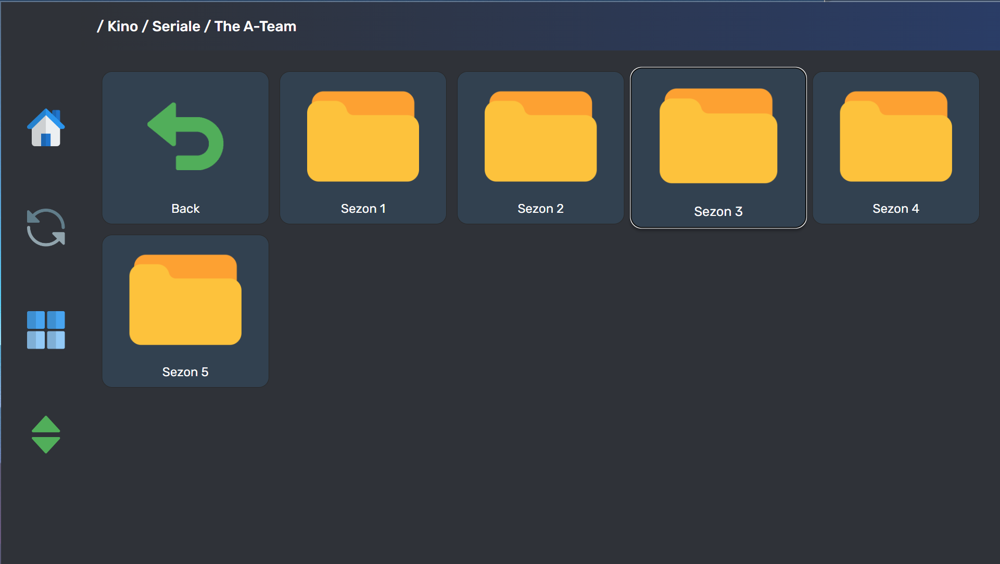

# Tizen TV app for browsing your photos and videos from your local file server.

## To use this app you need:

### 1. A HTTP server. 

* As you setup your HTTP server, you should put contents of 'server_side' folder into the base directory that is being hosted

* Check the 'src/common/common.js' file to setup the ip address of your HTTP server

* The base directory of your HTTP server should also contain the folder named 'externalDrive'. In my case that folder is where my external hard drive is being mounted for storing all my media files that will appear in the app's browser

* The 'externalDrive' folder should contain folder named 'Cloud'. The entire content of the folder 'Cloud' is the one and only that will be displayed in the app's browser

* If you want to use different paths, check 'src/common/common.js' and 'server_side/filetree.php' to edit the configuration

### 2. Use Thumbnail scripts

The 'server_side' folder also contains python scripts that generate thumbnails for the media files displayed in the app. Thumbnails are being generated into the folder named 'Thumbnails' that is located next to the 'Cloud' folder (under 'externalDrive' folder).

The app will easily work without thumbnails, but their presence surely upgrade the experience.

### 3. Compile the app and upload it to your TV

Build the app using Tizen SDK and deploy it to your TV using following sources:

* https://developer.samsung.com/smarttv/develop/getting-started/setting-up-sdk/installing-tv-sdk.html

* https://developer.samsung.com/smarttv/develop/getting-started/creating-tv-applications/importing-tv-applications.html

* https://docs.tizen.org/application/tizen-studio/common-tools/device-manager/

  

## Check out the Icons used from Pixel Perfect!    https://www.flaticon.com/authors/pixel-perfect